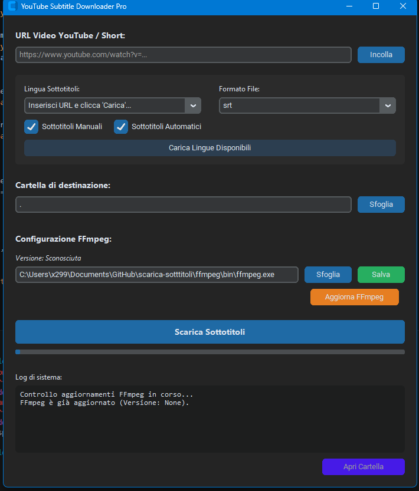

# YouTube Subtitle Downloader Pro

A professional tool for downloading and converting subtitles from YouTube videos and Shorts into high-quality formats like `.srt`, `.vtt`, or `.txt`.

## 🚀 Features

- **Language Detection**: Automatically fetches all available subtitles (manual and automatic) for any given video.
- **Smart Conversion**: Integrates FFmpeg to seamlessly convert WebVTT (`.vtt`) files to SubRip (`.srt`).
- **Automatic Dependency Management**: 
  - Automatically downloads and installs the correct version of **FFmpeg** if not found.
  - Attempts to install **Node.js** (JS Runtime) via Chocolatey for enhanced `yt-dlp` compatibility.
- **Modern GUI**: A clean, dark-themed interface built with `customtkinter`.
- **Flexible Filtering**: Choose between manual subtitles, automatically generated ones, or both.
- **Progress Tracking**: Real-time progress bar and detailed system logs.

## 🛠️ Technical Architecture

The application is divided into three main layers:
1. **GUI (`gui.py`)**: Manages the user interface, input validation, and asynchronous task execution using threading to keep the UI responsive.
2. **Core Logic (`logic.py`)**: Handles interaction with `yt-dlp`, manages subtitle extraction, and performs final file cleanup and conversion.
3. **FFmpeg Manager (`ffmpeg_manager.py`)**: A dedicated utility for managing FFmpeg binaries, including version checking against GitHub releases and configuration persistence in `config.json`.

## 📦 Installation & Requirements

### Prerequisites
- Python 3.8+
- Windows OS (Currently optimized for Windows)

### Setup
1. Clone the repository:
   ```bash
   git clone https://github.com/your-repo/scarica-sottotitoli.git
   cd scarica-sottitoli
   ```
2. Install dependencies:
   ```bash
   pip install -r requirements.txt
   ```
3. Run the application:
   ```bash
   python gui.py
   ```

## 📖 Usage

1. **Paste URL**: Insert the YouTube link into the URL field.
2. **Fetch Languages**: Click "Carica Lingue Disponibili" to see what's available for that specific video.
3. **Select Options**: Choose your preferred language, format (`srt`, `vtt`, `txt`), and filter (Manual/Auto).
4. **Set Destination**: Pick the folder where subtitles should be saved.
5. **Download**: Click "Scarica Sottotitoli". The app will handle everything from dependency checks to file conversion.

## ⚙️ Configuration

The app saves the FFmpeg path in `config.json` to avoid redundant searches on startup. You can manually update this path via the GUI's "Configurazione FFmpeg" section.


