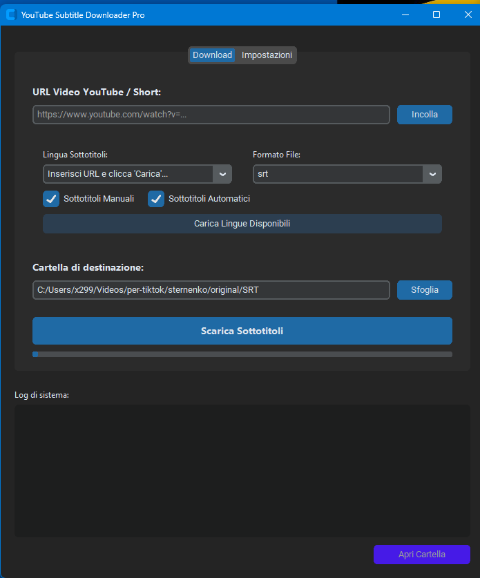

# YouTube Subtitle Downloader Pro



A professional tool for downloading and converting subtitles from YouTube videos and Shorts into high-quality formats like `.srt`, `.vtt`, or `.txt`.

 ## 🚀 Features

- **Language Detection**: Automatically fetches all available subtitles (manual and automatic) for any given video — or the union of languages across multiple URLs.
- **Playlist Support**: Paste a playlist URL and every video in it is processed with the same language and filter options.
- **Multi-URL Queue**: Paste multiple YouTube links (one per line) to download subtitles in sequence, continuing after errors with a final success/error summary.
- **Smart Conversion**: Integrates FFmpeg to seamlessly convert WebVTT (`.vtt`) files to SubRip (`.srt`); the `txt` format produces real plain-text files (timestamps and cue indices stripped).
- **Manual + Auto captions**: with both filters selected the app downloads manual subtitles *and* automatic ones (auto files get a `.auto` marker in the name, e.g. `Titolo.auto.en.vtt`, so they never overwrite manual ones).
- **Automatic Dependency Management**: 
  - Automatically downloads and installs the correct version of **FFmpeg** if not found.
  - Attempts to install **Node.js** (JS Runtime) via Chocolatey for enhanced `yt-dlp` compatibility.
- **Configurable Retry**: Number of attempts and delay between them are adjustable from the "Impostazioni" tab.
- **Modern GUI**: A clean, dark-themed interface built with `customtkinter`.
- **Flexible Filtering**: Choose between manual subtitles, automatically generated ones, or both.
- **Progress Tracking**: Real-time progress bar and detailed system logs.

## 🛠️ Technical Architecture

The application is divided into three main layers:
1. **GUI (`gui.py`)**: Manages the user interface, input validation, and asynchronous task execution using threading to keep the UI responsive.
2. **Core Logic (`logic.py`)**: Handles interaction with `yt-dlp`, manages subtitle extraction, and performs final file cleanup and conversion.
3. **FFmpeg Manager (`ffmpeg_manager.py`)**: A dedicated utility for managing FFmpeg binaries, including version checking against GitHub releases and configuration persistence in `config.json`.

## 📦 Installation & Requirements

### Prerequisites
- Python 3.10+ (required by yt-dlp)
- Windows OS (Currently optimized for Windows)

### Setup
1. Install dependencies:
   ```bash
   pip install -r requirements.txt
   ```
2. Run the application (paths to `config.json` and `ffmpeg/` are resolved relative to the script/exe directory, so any working directory works):
   ```bash
   python gui.py
   ```

## 📖 Usage

1. **Paste URL(s)**: Insert one or more YouTube links (video, Short or playlist) into the URL field — one URL per line for batch downloads.
2. **Fetch Languages**: Click "Carica Lingue Disponibili" to see what's available for the inserted video(s).
3. **Select Options**: Choose your preferred language, format (`srt`, `vtt`, `txt`), and filter (Manual/Auto).
4. **Set Destination**: Pick the folder where subtitles should be saved.
5. **Download**: Click "Scarica Sottotitoli". The app will handle everything from dependency checks to file conversion.

## ⚙️ Configuration

The app saves its settings in `config.json` to avoid redundant searches on startup:
- **FFmpeg path** — updated automatically after installation, or manually via the GUI's "Configurazione FFmpeg" section.
- **Retry attempts / delay** — adjustable from the "Impostazioni Retry" section (used when fetching subtitle languages over an unreliable network).

## 🧪 Testing & Linting

```bash
pip install -r requirements-dev.txt
python -m pytest tests -q   # logic + ffmpeg_manager (headless, no network)
python -m ruff check .       # lint (config in pyproject.toml)
```

CI (GitHub Actions) runs ruff + pytest on Windows (Python 3.11/3.13).

## 📦 Building the executable

`build/` and `dist/` are git-ignored, so the `.exe` is **not committed** — build it locally with PyInstaller:

```bash
# 1. Install dev dependencies (includes pyinstaller)
pip install -r requirements-dev.txt

# 2. Verify the code before building (recommended)
python -m pytest tests -q
python -m ruff check .

# 3. Build the single-file executable
python -m PyInstaller gui.spec   # oppure `pyinstaller gui.spec` se nel PATH
```

The output is `dist/gui.exe` (single-file, no console window).

Notes:
- `gui.spec` locates the customtkinter data path **automatically** from the Python environment used for the build (no hardcoded paths) — any Python 3.10+ works.
- Prefer `python -m PyInstaller` if the `pyinstaller` command is not on your PATH (e.g. when installed under `AppData\Roaming\Python` via pip's user install).
- FFmpeg is **not bundled**: on first run the app downloads it automatically (~100 MB) into `ffmpeg/bin/` next to the executable.

## 🗺️ Roadmap

Improvement plan: see [PLAN.md](PLAN.md).


